# 🤖 AI Paper Code Generator

**기술논문에서 AI 모델 코드를 자동 생성하는 지능형 Agent 시스템**

[](https://python.org)
[](https://fastapi.tiangolo.com)
[](https://streamlit.io)
[](https://tensorflow.org)

---

## 📋 프로젝트 개요

**AI Paper Code Generator**는 기술논문(PDF)을 분석하여 논문에서 제안하는 AI 모델의 TensorFlow/Keras 구현 코드를 자동으로 생성하는 시스템입니다.

### 🎯 주요 기능

- **📤 PDF 논문 업로드 및 자동 분석**
- **🤖 AI 모델 아키텍처 추출 및 스펙 생성**
- **🏗️ 다양한 모델 템플릿 지원** (Transformer, CNN, ResNet, RNN, GAN, VAE, UNet 등)
- **⚡ 지능형 템플릿 라우팅** (논문 내용 기반 최적 템플릿 선택)
- **🔧 슬롯 기반 코드 완성** (LLM + 자동블록 주입)
- **📊 코드 품질 분석 및 리플렉션**
- **💬 논문 내용 기반 QA 시스템**
- **💾 생성 코드 영속화 및 다운로드**

### 🏗️ 시스템 아키텍처

```mermaid
graph TB
    A[PDF 업로드] --> B[텍스트 추출]
    B --> C[AI 분석 파이프라인]
    C --> D[문서 요약]
    C --> E[도메인 분류]  
    C --> F[모델 스펙 추출]
    F --> G[템플릿 라우팅]
    G --> H[Jinja2 렌더링]
    H --> I[슬롯 주입]
    I --> J[품질 분석]
    J --> K[TensorFlow 코드]
    K --> L[파일 저장]
    
    C --> M[벡터 임베딩]
    M --> N[QA 시스템]
```



---

## 🚀 설치 방법

### 📋 필수 요구사항

- **Python 3.8+**
- **pip 또는 conda**
- **Git**

### 🛠️ 설치 단계

1. **저장소 클론**
```bash
git clone https://github.com/your-username/ai-paper-code-generator.git
cd ai-paper-code-generator
```

2. **가상환경 생성 및 활성화**
```bash
# conda 사용 시
conda create -n paper-ai python=3.8
conda activate paper-ai

# venv 사용 시  
python -m venv venv
source venv/bin/activate  # Windows: venv\Scripts\activate
```

3. **의존성 패키지 설치**
```bash
pip install -r requirements.txt
```

4. **환경변수 설정**
```bash
# .env 파일 생성
cp .env.example .env

# .env 파일에 API 키 설정
OPENAI_API_KEY=your_openai_api_key_here
# 기타 필요한 환경변수들...
```

5. **데이터베이스 초기화**
```bash
# SQLite DB는 자동으로 생성됩니다
# 필요시 migration 실행
```

---

## 💡 사용법 및 예제

### 🖥️ 시스템 실행

1. **Backend API 서버 시작**
```bash
# FastAPI 서버 실행 (포트 8000)
uvicorn backend.main:app --reload --host 0.0.0.0 --port 8000
```

2. **Frontend UI 실행**
```bash
# 새 터미널에서 Streamlit 앱 실행
streamlit run app.py
```

3. **브라우저에서 접속**
```
http://localhost:8501
```

### 📖 사용 예제

#### 1. PDF 논문 업로드 및 분석

```python
# API를 통한 직접 호출 예제
import requests

# 논문 업로드 및 즉시 질문
files = {"file": ("paper.pdf", open("paper.pdf", "rb"), "application/pdf")}
data = {"question": "이 논문에서 제안하는 모델의 구조를 설명해주세요"}

response = requests.post(
    "http://localhost:8000/documents/upload",
    files=files,
    data=data
)

result = response.json()
print(f"생성된 코드 경로: {result['basecode_py_path']}")
print(f"모델 요약: {result['basecode_summary']}")
```

#### 2. 생성된 코드 실행 예제

```python
# 생성된 코드 파일을 import하여 모델 빌드
import sys
sys.path.append('/path/to/generated/code')

from transformer_basecode import build_model

# 모델 생성
model = build_model()
print(model.summary())

# 모델 컴파일 및 훈련
model.compile(optimizer='adam', loss='sparse_categorical_crossentropy', metrics=['accuracy'])
# model.fit(X_train, y_train, validation_data=(X_val, y_val), epochs=10)
```

#### 3. 기존 문서에 추가 질문

```python
# 기존 문서에 대한 질문
payload = {
    "document_id": 1,
    "question": "이 모델의 하이퍼파라미터 설정 방법은?"
}

response = requests.post(
    "http://localhost:8000/qa/ask_existing",
    json=payload
)

answer = response.json()["answer"]
print(answer)
```

### 🎨 지원하는 모델 템플릿

| 모델 계열 | 템플릿 | 지원 기능 |
|-----------|--------|-----------|
| **Transformer** | `transformer.j2` | Multi-head Attention, Encoder-Decoder |
| **CNN Family** | `cnn_family.j2` | Conv2D, Pooling, Inception, SE Block |
| **ResNet** | `resnet.j2` | Residual Connection, Bottleneck |
| **RNN/LSTM** | `rnn_seq.j2` | LSTM, GRU, Attention Mechanism |
| **GAN** | `gan.j2` | Generator, Discriminator, GAN Loss |
| **VAE** | `vae.j2` | Encoder, Decoder, KL Divergence |
| **U-Net** | `unet.j2` | Encoder-Decoder with Skip Connection |
| **Autoencoder** | `autoencoder.j2` | Encoder, Decoder, Regularization |

---

## 📚 API 문서

### 🌐 FastAPI 자동 문서

시스템 실행 후 다음 URL에서 Interactive API 문서를 확인할 수 있습니다:

- **Swagger UI**: http://localhost:8000/docs
- **ReDoc**: http://localhost:8000/redoc

### 🔗 주요 엔드포인트

#### 📤 문서 업로드 및 분석

```http
POST /documents/upload
Content-Type: multipart/form-data

Parameters:
- file: PDF 파일 (required)
- question: 즉시 질문 (required)

Response:
{
    "filename": "paper.pdf",
    "document_id": 1,
    "summary": "논문 요약...",
    "domain": "computer_vision",
    "answer": "질문에 대한 답변...",
    "used_model": "transformer",
    "basecode_py_path": "/path/to/generated.py",
    "basecode_source": "# Generated TensorFlow code...",
    "basecode_summary": "모델 아키텍처 요약..."
}
```

#### 📋 문서 목록 조회

```http
GET /documents

Response:
[
    {
        "id": 1,
        "filename": "paper.pdf", 
        "domain": "computer_vision",
        "summary": "논문 요약...",
        "uploaded_at": "2024-01-01T00:00:00"
    }
]
```

#### 💬 기존 문서 질문

```http
POST /qa/ask_existing
Content-Type: application/json

Body:
{
    "document_id": 1,
    "question": "모델의 성능은 어떤가요?"
}

Response:
{
    "answer": "질문에 대한 상세한 답변..."
}
```

#### 📊 QA 히스토리 조회

```http
GET /qa/{document_id}

Response:
[
    {
        "question": "질문 내용",
        "answer": "답변 내용", 
        "created_at": "2024-01-01T00:00:00"
    }
]
```

#### 💾 생성된 코드 조회

```http
GET /documents/{doc_id}/basecode

Response:
{
    "exists": true,
    "model_key": "transformer",
    "py_path": "/path/to/generated.py",
    "source": "# Generated Python code...",
    "summary": "모델 구조 요약..."
}
```

---

## 🛠️ 개발 가이드

### 📁 프로젝트 구조

```
ai-paper-code-generator/
├── 📁 backend/              # FastAPI 백엔드
│   ├── 📄 main.py          # API 서버 진입점
│   ├── 📁 routes/          # API 엔드포인트들
│   ├── 📄 models.py        # SQLAlchemy 데이터베이스 모델
│   ├── 📄 schemas.py       # Pydantic 스키마
│   └── 📄 database.py      # DB 연결 설정
├── 📁 services/            # 핵심 서비스 로직
│   ├── 📄 pipeline_basecode.py    # 메인 코드 생성 파이프라인
│   ├── 📄 graph_builder.py        # LangGraph 오케스트레이션
│   ├── 📄 routing.py              # 템플릿 라우팅 로직
│   ├── 📄 codegen.py              # Jinja2 코드 렌더링
│   ├── 📁 templates/              # Jinja2 템플릿 파일들
│   └── 📄 spec_schema.py          # 모델 스펙 스키마
├── 📄 app.py               # Streamlit 프론트엔드
├── 📄 templates_manifest.json     # 템플릿 메타데이터
├── 📄 requirements.txt     # Python 의존성
├── 📄 .env.example         # 환경변수 예제
└── 📄 README.md           # 이 파일
```

### 🔧 새 템플릿 추가하기

1. **템플릿 파일 생성**
```bash
# services/templates/에 새 .j2 파일 추가
touch services/templates/my_model.j2
```

2. **템플릿 메타데이터 등록**
```json
// templates_manifest.json에 추가
{
    "file": "my_model.j2",
    "path": "/full/path/to/my_model.j2", 
    "family": "my_model",
    "type": "slot",
    "version": "v1",
    "slots": ["encoder", "decoder", "head"],
    "bytes": 1234
}
```

3. **라우팅 규칙 추가**
```python
# services/routing.py에 라우팅 로직 추가
def resolve_template_from_spec(spec: Dict[str, Any]) -> Tuple[str, Dict]:
    # 새 모델 패밀리에 대한 라우팅 규칙 추가
    pass
```

### 🧪 테스트

```bash
# 단위 테스트 실행
python -m pytest tests/

# 특정 테스트 실행  
python -m pytest tests/test_codegen.py -v

# 커버리지 측정
python -m pytest --cov=services tests/
```

### 🐛 디버깅

환경변수를 통한 디버그 모드 활성화:

```bash
export DEBUG_BASECODE=true
export ROUTING_DEBUG=true
export USE_LLM_ASSIST=false  # LLM 비활성화
```

---

## 🤝 기여 방법

### 📝 기여 가이드라인

1. **Fork & Clone**
```bash
git clone https://github.com/your-username/ai-paper-code-generator.git
```

2. **Feature Branch 생성**
```bash
git checkout -b feature/your-feature-name
```

3. **개발 및 테스트**
```bash
# 코드 작성
# 테스트 추가/실행
python -m pytest tests/
```

4. **코드 스타일 검사**
```bash
# Black 포맷팅
black services/ backend/ 

# Lint 검사
flake8 services/ backend/
```

5. **Pull Request 생성**
- 명확한 제목과 설명 작성
- 변경사항에 대한 테스트 포함
- 관련 이슈 번호 참조

### 🐛 버그 리포트

GitHub Issues를 통해 버그를 신고해 주세요:

- **버그 설명**: 명확하고 간결한 설명
- **재현 단계**: 단계별 재현 방법
- **예상 결과**: 어떤 결과를 예상했는지
- **실제 결과**: 실제로 어떤 일이 일어났는지
- **환경 정보**: OS, Python 버전, 의존성 버전 등

### 💡 기능 제안

새로운 기능 아이디어가 있으시면 GitHub Discussions 또는 Issues를 통해 제안해 주세요.

---

## 📄 라이선스

이 프로젝트는 **MIT 라이선스** 하에 배포됩니다. 자세한 내용은 [LICENSE](LICENSE) 파일을 참조하세요.

```
MIT License

Copyright (c) 2024 AI Paper Code Generator Team

Permission is hereby granted, free of charge, to any person obtaining a copy
of this software and associated documentation files (the "Software"), to deal
in the Software without restriction, including without limitation the rights
to use, copy, modify, merge, publish, distribute, sublicense, and/or sell
copies of the Software, and to permit persons to whom the Software is
furnished to do so, subject to the following conditions:

The above copyright notice and this permission notice shall be included in all
copies or substantial portions of the Software.

THE SOFTWARE IS PROVIDED "AS IS", WITHOUT WARRANTY OF ANY KIND, EXPRESS OR
IMPLIED, INCLUDING BUT NOT LIMITED TO THE WARRANTIES OF MERCHANTABILITY,
FITNESS FOR A PARTICULAR PURPOSE AND NONINFRINGEMENT. IN NO EVENT SHALL THE
AUTHORS OR COPYRIGHT HOLDERS BE LIABLE FOR ANY CLAIM, DAMAGES OR OTHER
LIABILITY, WHETHER IN AN ACTION OF CONTRACT, TORT OR OTHERWISE, ARISING FROM,
OUT OF OR IN CONNECTION WITH THE SOFTWARE OR THE USE OR OTHER DEALINGS IN THE
SOFTWARE.
```

---

## 📞 연락처 및 지원

- **GitHub Issues**: 버그 신고 및 기능 요청
- **GitHub Discussions**: 일반적인 질문 및 토론
- **Email**: support@your-domain.com

---

## 🙏 감사의 말

이 프로젝트는 다음 오픈소스 라이브러리들을 사용합니다:

- [FastAPI](https://fastapi.tiangolo.com/) - 현대적인 고성능 웹 API 프레임워크
- [Streamlit](https://streamlit.io/) - 데이터 앱 구축 도구  
- [LangChain](https://langchain.com/) - LLM 애플리케이션 개발 프레임워크
- [TensorFlow](https://tensorflow.org/) - 머신러닝 플랫폼
- [Jinja2](https://jinja.palletsprojects.com/) - 템플릿 엔진
- [SQLAlchemy](https://sqlalchemy.org/) - SQL 툴킷 및 ORM

---

⭐ **이 프로젝트가 도움이 되셨다면 Star를 눌러주세요!** ⭐

